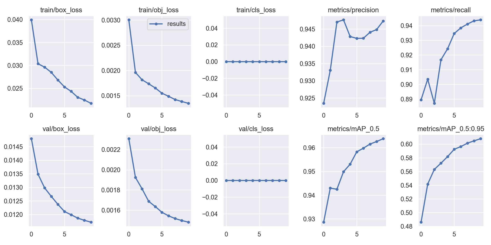

# anti-uav-yolo
Tools for converting Anti UAV data into a format usable for YOLOv5.

## Data set
I am using the Anti-UAV data set to train the neural network. For training, testing and validation,
I saved each frame as a 256 x 144 JPEG image. Then I trained on a YoloV5 network using this command:
```sh
python train.py --img 256 --cfg yolov5s.yaml --hyp hyp.scratch-med.yaml --batch 32 --epochs 10 --data anti_uav_data.yaml --weights yolov5s.pt --workers 24 --name yolo_anti_uav
```
This took several days to run on my 8-core Intel i7 desktop PC.
The Anti-UAV videos were recorded in 1080p, however since the training was taking so long I scaled them down.
I was able to get decent results with this size:




## Running the Norfair tracker
Used this command
```sh
python yolov5demo.py <TestVideo>.mp4 --img_size 1080 --detector_path best.pt --classes 0 --track_points bbox
```
